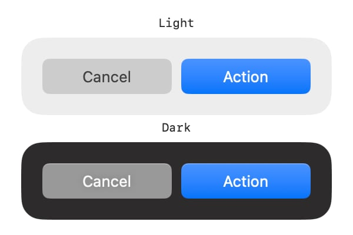

# FoundationUI

<p align="left">


</p>

A framework designed to streamline and accelerate the prototyping and development of user interfaces using SwiftUI.

## Idea
FoundationUI was created to simplify and accelerate the development of SwiftUI-based applications. 
By abstracting repetitive tasks and offering intuitive, reusable components, it empowers developers to focus on delivering great user experiences.

## Core Principles
1.	**Simplicity:** Easy-to-adopt APIs with minimal boilerplate.
2.	**Extensibility:** Modular design for seamless integration into any project.
3.	**Discoverability:** Rich documentation and intuitive structure to make it easy to explore and utilize the design system.
4.	**Consistency:** Centralized theming and dynamic colors ensure a unified design.

## Mission
To bridge the gap between rapid prototyping and production-ready apps, empowering developers to swiftly create refined interfaces while maintaining best practice standards.

# Quick Start Guide

## Setup

1. Add package using Swift Package Manager ([Adding Package Dependencies to Your App](https://developer.apple.com/documentation/xcode/adding-package-dependencies-to-your-app))
```
https://github.com/artlasovsky/foundation-ui
```

2. Import FoundationUI in your Swift files:
```swift
import FoundationUI
```

## Core Concepts

### 1. Theme System
FoundationUI uses an extensible theme system. Create your design tokens by extending the `Theme` namespace:

```swift
// Theme.swift
import FoundationUI

public extension Theme.Padding {
    static let small = Theme.Padding(6)
    static let regular = Theme.Padding(8)
	static let large = regular + regular * 0.5 // 12
}

public extension Theme.Size {
    static let standard = Theme.Size(width: 110, height: 30)
}
```

### 2. Modifiers
Apply styling using `.foundation()` modifiers:

```swift
Text("Hello World")
    .foundation(.size(.standard))
    .foundation(.padding(.small, .horizontal))
```

### 3. Dynamic Colors
Create adaptive colors that respond to color scheme changes:

> Note: Use Swift's Access Control features to control scope of the theme extensions.

```swift
private extension Theme.Color {
    static let regular = Theme.Color(
        light: .init(grayscale: 0.8),
        dark: .init(grayscale: 0.6)
    )
}

// Usage
myView.foundation(.background(.regular))
```

### 4. Basic Component Example
Here's a simple example combining these concepts:

```swift
struct SimpleButton: View {
    var body: some View {
        Text("Click Me")
            .foundation(.size(.standard))
            .foundation(.foreground(.white))
            .foundation(.background(Theme.Color.from(color: .accentColor)))
            .foundation(.cornerRadius(.small))
    }
}
```

## Next Steps
- Check out the [detailed example](#example-building-a-native-style-button) for a more comprehensive implementation
- Explore the DocC documentation to explore advanced features


# Example: Building a Native-Style Button

This example demonstrates FoundationUI's capabilities by creating a custom button style that matches native macOS design. 
We'll build a button with two variants (prominent and regular) that:
- Adapts to light and dark color schemes
- Responds to pressed states
- Includes highlighting effects in dark mode

## Visual Progress
| Unstyled (Step 1) | Basic Styling (Step 2) | Polished (Step 3) |
|-|-|-|
| ![Step 1][step01] | ![Step 2][step02] | ![Step 3][step03] |

[step01]: Documentation.docc/Resources/ReadmeSample/Images/readme_sample_01.jpg
[step02]: Documentation.docc/Resources/ReadmeSample/Images/readme_sample_02.jpg
[step03]: Documentation.docc/Resources/ReadmeSample/Images/readme_sample_03.jpg
[sample_files]: Documentation.docc/Resources/ReadmeSample

## Code

Download the final example files here:
[Documentation.docc/Resources/ReadmeSample][sample_files]

## Step 1: Unstyled `CustomButtonStyle` and Preview

First, we'll set up the basic button structure. This shows the minimal setup needed before applying FoundationUI's styling features.

```swift
// FILE: - CustomButtonStyle.swift

struct CustomButtonStyle: ButtonStyle {
	var variant: CustomButtonStyleVariant = .regular

	func makeBody(configuration: Configuration) -> some View {
		configuration.label
	}
}

enum CustomButtonStyleVariant {
	case prominent
	case regular
}

struct CustomButtonStylePreview: View {
	var body: some View {
		VStack {
			buttonGroup(.light)
			buttonGroup(.dark)
		}
		.padding()
		.background(.background)
	}

	func buttonGroup(_ colorScheme: ColorScheme) -> some View {
		VStack {
			Text(colorScheme == .light ? "Light" : "Dark")
				.monospaced()
				.font(.caption)
			HStack {
				Button("Cancel") {}
					.buttonStyle(CustomButtonStyle())
				Button("Action") {}
					.buttonStyle(CustomButtonStyle(variant: .prominent))
			}
			.padding(18)
			.background(.windowBackground, in: .rect(cornerRadius: 18))
			.environment(\.colorScheme, colorScheme)
		}
	}
}

#Preview {
	CustomButtonStylePreview()
}
```

<div align="center">
	
</div>


## Step 2 - Essentials

### Theme
FoundationUI doesn't include a default theme, as each team has its own naming conventions. 
It can be effortlessly extended with your design system tokens using the `extension Theme.{Variable} {}`.

#### Padding and Radius
We will create a `Theme.swift` file and add tokens to the `Radius` variable.

```swift
// FILE: - Theme.swift

import FoundationUI

public extension Theme.Radius {
	static let xxSmall = Theme.Radius(2)
	static let xSmall = Theme.Radius(4)
	static let small = Theme.Radius(6)
	static let regular = Theme.Radius(8)
	static let large = Theme.Radius(12)
	static let xLarge = Theme.Radius(18)
	static let xxLarge = Theme.Radius(24)
}
```

#### FoundationUI Modifiers

Import `FoundationUI` and create a token for the `Size` variable,
then use the `.foundation(.size())` view modifier to set the size. 

```swift
// FILE: - CustomButtonStyle.swift
import FoundationUI

private extension Theme.Size {
	static let button = Theme.Size(width: 110, height: 30)
}

struct CustomButtonStyle: ButtonStyle {
	var variant: CustomButtonStyleVariant = .regular
	
	func makeBody(configuration: Configuration) -> some View {
		configuration.label
			.foundation(.size(.button))
	}
}

/// ...
```

#### DynamicColor
Next, we'll create the `background` token. Currently, we have two button styles: `regular` and `prominent`. Additionally, we need to show the `isPressed` state.

Let's extend `Theme.Color`. It based on FoundationUI's `DynamicColor` designed to be flexible: 
- It can be created with multiple `ColorComponents` across various color models (HSB, RGB, HEX, OKLCH) or through native colors (SwiftUI.Color, UIColor, NSColor).
- You have the option to configure each component for various color schemes: `light`, `dark`, `lightAccessible`, and `darkAccessible`
- It has built-in modifiers, such as brightness, hue, saturation, opacity, blendMode, and more.

```swift
// FILE: - CustomButtonStyle.swift
private extension Theme.Color {
	static func background(_ variant: CustomButtonStyleVariant, isPressed: Bool) -> Theme.Color {
		let color: Theme.Color
		switch variant {
		case .prominent:
			color = .from(color: .accentColor)
		case .regular:
			color = .init(
				light: .init(grayscale: 0.8),
				dark: .init(grayscale: 0.6)
			)
		}
		return color.brightness(isPressed ? 0.9 : 1)
	}
}
```

then create `foreground` token:
```swift
// FILE: - CustomButtonStyle.swift
private extension Theme.Color {
	/// static func background(...){ ... }
	static func foreground(_ variant: CustomButtonStyleVariant) -> Theme.Color {
		switch variant {
		case .prominent:
			.white
		case .regular:
			.init(
				light: .init(grayscale: 0.25),
				dark: .init(grayscale: 0.98)
			)
		}
	}
}
```

and finally add FountationUI's view modifiers to the `makeBody()`:

```swift
// FILE: - CustomButtonStyle.swift
struct CustomButtonStyle: ButtonStyle {
	// ...
	func makeBody(configuration: Configuration) -> some View {
			configuration.label
				.foundation(.size(.button))
				.foundation(.foreground(.foreground(variant)))
				.foundation(.background(.background(variant, isPressed: isPressed)))
	}
	// ...
}
```


It's time to use one of the `Theme.Radius` tokens we declared initially. 
We'll apply it with the `.foundation(.cornerRadius())` view modifier, which automatically adjusts the shape of `.foundation(.background())`. 

```swift
// FILE: - CustomButtonStyle.swift
struct CustomButtonStyle: ButtonStyle {
	// ...
	func makeBody(configuration: Configuration) -> some View {
			configuration.label
				.foundation(.size(.button))
				.foundation(.foreground(.foreground(variant)))
				.foundation(.background(.background(variant, isPressed: isPressed)))
				.foundation(.cornerRadius(.small))
	}
	// ..
}
```

<div align="center">
	
</div>

## Step 3 - Details

For the final step, we will modify the highlight for the dark variant of the `CustomButtonStyle`. A vertical linear gradient will be applied over the background. 
FoundationUI provides `Theme.Gradient` with the custom `DynamicGradient` ShapeStyle, streamlining the creation and reuse of gradients.

> **Note:** The `.foundation(.backgroundGradient())` view modifier automatically inherits the cornerRadius value from the `.foundation(.cornerRadius())` modifier, same way as the `.foundation(.background())`.
>\
> This behavior is enabled by default but can be adjusted or disabled. 

```swift
// FILE: - CustomButtonStyle.swift
private extension Theme.Gradient {
	static let backgroundHighlight = Theme.Gradient(
		colors: [
			.white, 
			.white.opacity(0.5), 
			.black.opacity(0.1)
		],
		type: .linear(startPoint: .top, endPoint: .bottom)
	).opacity(0.2)
}

struct CustomButtonStyle: ButtonStyle {
	// ...
	func makeBody(configuration: Configuration) -> some View {
			configuration.label
				.foundation(.size(.button))
				.foundation(.foreground(.foreground(variant)))
				.foundation(.backgroundGradient(.backgroundHighlight), bypass: !isShowingBackgroundHighlight)
				.foundation(.background(.background(variant, isPressed: isPressed)))
				.foundation(.cornerRadius(.small))
	}

	/// Conditionally showing background highlight
	private var isShowingBackgroundHighlight: Bool {
		switch variant {
		case .prominent: true
		case .regular: false
		}
	}
	// ...
}
```

> **Hint:**
> If a token, such as `Theme.Color` in this example, is only used once and is not intended for use elsewhere, it can be stored anywhere and referenced directly rather than being placed within `Theme.Color`.

```swift
// FILE: - CustomButtonStyle.swift
private extension Theme.Gradient {
	// static let backgroundHighlight = ...

	static let topEdgeHighlight = Theme.Gradient(
		stops: [
			.init(color: topEdgeHighlightColor, location: 0),
			.init(color: .clear, location: 0.15)
		],
		type: .linear(startPoint: .top, endPoint: .bottom)
	)
	
	private static let topEdgeHighlightColor = Theme.Color(
		light: .init(grayscale: 0, opacity: 0),
		dark: .init(grayscale: 1, opacity: 0.5)
	)
	.blendMode(.vibrant)
}

struct CustomButtonStyle: ButtonStyle {
	private static let topEdgeHighlightWidth: CGFloat = 0.75
	
	// ...
	
	func makeBody(configuration: Configuration) -> some View {
			configuration.label
				.foundation(.size(.button))
				.foundation(.foreground(.foreground(variant)))
				.foundation(.borderGradient(.topEdgeHighlight, width: Self.topEdgeHighlightWidth, placement: .inside))
				.foundation(.backgroundGradient(.backgroundHighlight), bypass: !isShowingBackgroundHighlight)
				.foundation(.background(.background(variant, isPressed: isPressed)))
				.foundation(.cornerRadius(.small))
	}
	// ...
}
```

<div align="center">
	
</div>

## Done!
Your button now features a polished, native-like appearance that:
- Seamlessly adapts to both light and dark modes
- Features subtle gradient highlights on the background and edges
- Provides appropriate visual feedback for press states
- Maintains consistent styling with FoundationUI's theme tokens

This example illustrates how FoundationUI's modifiers and theme system collaborate to create sophisticated, maintainable UI components. 
By separating style tokens into Theme extensions and utilizing features like DynamicColor and DynamicGradient, you can craft reusable components that naturally integrate with the platform while keeping your code tidy and organized.

<br/>
<br/>
<br/>

# Roadmap

## Q1 '25
- [ ] Changelog
- [ ] Tests
	- [ ] DynamicColor / ColorComponents
	- [ ] Modifiers
	- [ ] Variables
- [ ] Code Documentation: DynamicColor / ColorComponent inits and methods
- [ ] Code Documentation: Modifiers
- [ ] Documentation: Basic Interactive Tutorials
	- [ ] How to extend theme (`Color`, `Padding`, `Size`, `Font`, `Radius`)
	- [ ] How to create tokens with state (`isPressed`, `isHovered`, etc.)
	- [ ] How to work with nested radii (`DynamicRoundedRectangle`)
	- [ ] Cross platform design system
	- [ ] How to use default theme
- [ ] Documentation: Advanced Interactive Tutorials
	- [ ] Theme scope
	- [ ] Create sharable themes
	- [ ] Advanced features of the framework
	- [ ] Extending the features of the framework
- [ ] watchOS support
- [ ] Add OKLCH support
